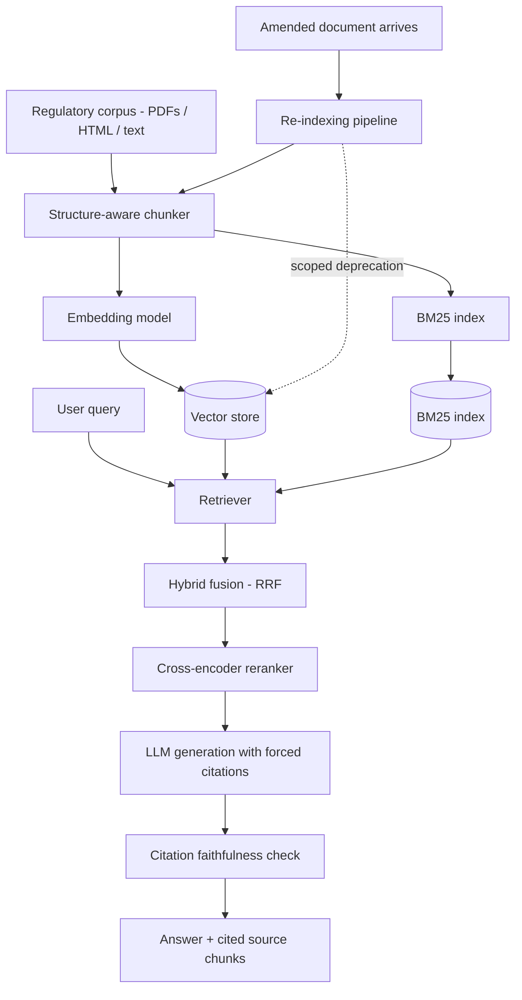
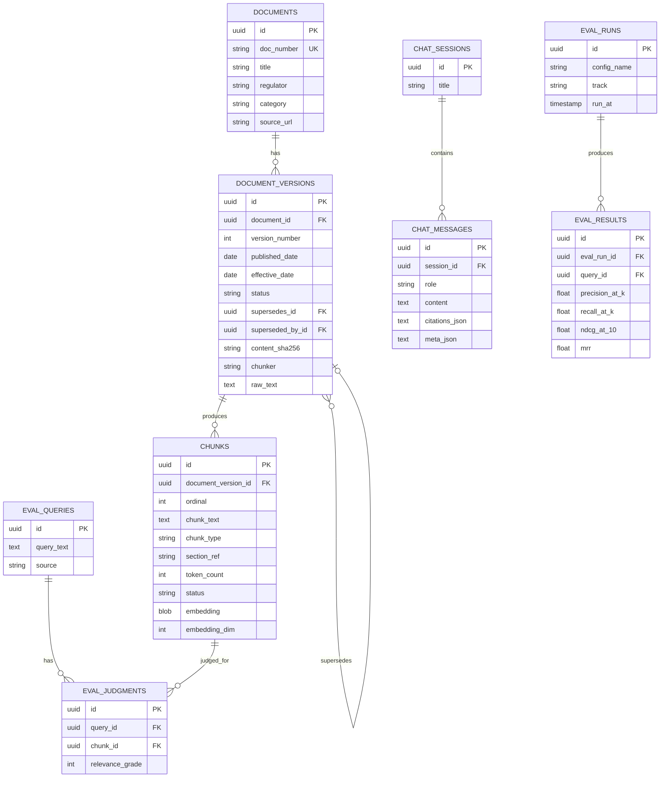
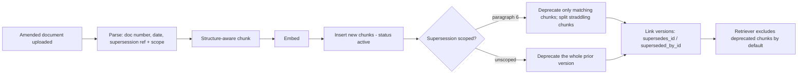

# Regulation-Tracking RAG System — Project Details

Full technical specification of the implemented system. For a quickstart, the API surface and the measured results, see [`README.md`](./README.md).

---

## 1. Overview

**What it is**: A retrieval-augmented generation system over Indian financial regulatory documents (RBI Master Circulars / Master Directions / notifications) that answers compliance-style questions with cited sources, correctly handles documents that amend or supersede earlier ones, and is evaluated with real information-retrieval metrics rather than manual spot-checking.

**Why this domain, specifically**: A single clean PDF has no retrieval difficulty, which means there's nothing genuine to evaluate. Regulatory circulars have three properties a generic PDF doesn't:

1. **They amend and supersede each other** — a 2026 circular can partially override a 2016 Master Direction. This creates a real stale-data problem to solve, not a hypothetical one.
2. **Tables mixed with prose** (rate schedules, thresholds, effective dates) — forces genuine chunking decisions instead of naive fixed-size splitting.
3. **Cross-references** ("as per para 4.2 of circular X") — creates real multi-hop retrieval difficulty, and is also the signal the supersession parser keys off.

**Delivered in v1**:

- FastAPI service + single-page chat UI (chat, citation drill-down, retrieval-mode switching, audit mode, upload).
- Ingestion pipeline: PDF/HTML/text parsing → three selectable chunkers → embeddings → versioned storage.
- Re-indexing pipeline with **scoped supersession** (paragraph-level), chunk splitting, and non-destructive deprecation.
- Retrieval: BM25, dense, RRF hybrid, cross-encoder/lexical reranking, all sharing one corpus snapshot.
- Generation with forced citations, an out-of-domain refusal gate, and an automated citation-faithfulness check.
- Evaluation harness: graded-relevance IR metrics, two experiment sweeps, a faithfulness sweep, BEIR track, results persisted to the database.
- 43 automated tests + CI that runs the tests, the index build, the evaluation and the case study.

**Non-goals for v1**:

- Not a source of legal or financial advice (see §14).
- No multi-tenant access control or user accounts.
- No scheduled crawling: ingestion is triggered by upload, CLI, or an explicit fetch run.

---

## 2. Tech stack

| Layer | Choice | Why |
|---|---|---|
| Vector storage | SQLite by default; **pgvector** on Postgres via `DATABASE_URL` | Chunks, metadata and version status stay in one relational, queryable place; SQLite means the project runs with zero infrastructure, Postgres means it scales without a code change |
| Sparse retrieval | `rank_bm25` (Okapi) over the in-memory corpus snapshot | Standard lexical baseline; regulatory queries frequently contain exact identifiers (`14.01.001`, `SMA-2`) |
| Dense embeddings | `hashing` (default) or self-hosted `sentence-transformers` (`bge-small-en-v1.5`, `e5-small`) | The default is deterministic and download-free, which makes CI and evaluation reproducible; the neural provider is one env var away |
| Fusion | Reciprocal Rank Fusion, k=60 | Rank-based, so BM25's unbounded scores and cosine's 0–1 scores need no normalisation |
| Reranker | `lexical` (IDF coverage + phrase proximity + length penalty) or `bge-reranker-base` cross-encoder | Reorders the fused candidates; the fallback keeps the system runnable with no model downloads |
| Generation LLM | `extractive` (default), Groq (Llama 3.3), Gemini Flash, OpenAI | Extractive mode composes the answer from the retrieved passages themselves — no key required, and citations are exact by construction |
| Evaluation | Own graded-relevance implementations of P@k, R@k, nDCG@10, MRR, cross-checked against `ranx` when installed; BEIR FiQA-2018 for Track A | Real IR methodology; pinned to hand-computed values in `tests/test_metrics.py` |
| Document parsing | `pypdf` for PDFs, `BeautifulSoup`/`lxml` for HTML with tables rendered as pipe rows | Preserves the structure the chunker needs instead of flattening to raw text |
| Backend | FastAPI + SQLAlchemy 2.0 (typed ORM) | Typed request/response models, auto-generated OpenAPI |
| Frontend | Vanilla JS + CSS served by FastAPI | No build step, no node toolchain, deploys as one container |
| Hosting | Docker / docker-compose; Cloud Run, Koyeb, Fly free tiers | CPU-only image |

---

## 3. System architecture

### Request lifecycle (`POST /api/chat`)

1. `RetrievalService.ensure_index()` — rebuilds the corpus snapshot if a previous ingest marked it dirty (lazy, lock-guarded, so concurrent requests never see a half-built index).
2. Sparse and dense candidate retrieval over the **same** snapshot, filtered to `status='active'` unless audit mode is on.
3. RRF fusion → cross-encoder/lexical reranking → top-k passages.
4. Retrieval-confidence gate: if the top passages cover <40 % of the question's content words, the system refuses instead of answering.
5. Generation with the forced-citation contract (or extractive composition).
6. Faithfulness check on every cited sentence.
7. Amendment notices (superseded text included; sources spanning multiple publication dates).
8. Persist the turn to `chat_messages` with retrieval/faithfulness/usage metadata attached.

---

## 4. Corpus design

- Scope is one coherent slice of RBI regulation rather than everything: KYC/AML, digital lending, stressed assets, customer service, cards, priority-sector lending, cyber security.
- `corpus/seed/` ships eight format-faithful fixture circulars, including **one real amendment chain** (2016 KYC Master Direction ← 2026 amendment that supersedes paragraph 6). The chain is a hard requirement, not a nice-to-have: the re-indexing case study depends on it existing.
- `ingestion/fetch_rbi.py` downloads the genuine documents from rbi.org.in (listing scrape → per-document fetch → PDF preference → `manifest.json` with URL/title/timestamp).
- Every stored version keeps its raw text, publication date, content SHA-256, source path and the chunker used to produce it.

---

## 5. Parsing

`ingestion/parse.py` normalises Unicode punctuation and whitespace, then extracts:

| Field | Method |
|---|---|
| `doc_number` | `RBI/2026-27/88` or `RBI/DBR/2015-16/18`, falling back to the departmental circular number (`DOR.AML.REC.42/14.01.001/2026-27`) |
| `title` | First plausible line — skipping salutations, identifiers and digit-heavy lines |
| `published_date` | Three date formats (`18 September 2026`, `September 18, 2026`, ISO) |
| `supersedes_hint` | The circular reference inside an "in supersession of / supersedes / amends the …" clause |
| `supersedes_scope` | The paragraph numbers that clause names — `["6"]` for *"in supersession of paragraph 6 of …"* |

HTML tables are rewritten as `[TABLE] … [/TABLE]` blocks of pipe-delimited rows so the chunker can keep them atomic.

---

## 6. Chunking strategy — compared, not assumed

| Strategy | Description | Result on this corpus |
|---|---|---|
| `fixed` | Fixed token windows with overlap | Best Precision@5 (0.274); splits tables and sentences |
| `recursive` | Paragraph → sentence boundaries, packed to a token budget with an overlap tail | Best nDCG@10 (0.946) and MRR (0.930) |
| `structure_aware` | Splits on headings/numbered paragraphs, keeps tables atomic, attaches the section path as metadata and as a prefix to the embedded text | Lower raw IR scores (more, smaller chunks), but the only one that preserves table integrity and paragraph-level provenance |

`structure_aware` is the **default** despite not topping the table, because the amendment pipeline needs paragraph-level `section_ref` to scope a supersession, and because table answers (compensation schedules, SMA thresholds, PSL targets) must not be split. That trade-off is stated explicitly rather than buried — and the numbers that contradict the intuition are published in the README.

Structure-aware details:

- Heading detection: numbered (`4.`, `4.2`, `4.2.1`), `Annex/Appendix/Schedule/Chapter/Part/Section`, and ALL-CAPS lines.
- Tables (`[TABLE]` blocks or runs of ≥2-pipe lines) become their own chunk with `chunk_type='table'`.
- Over-budget sections split on paragraph boundaries while keeping their `section_ref`.
- Chunks below 40 tokens are merged into the previous prose chunk.

---

## 7. Retrieval architecture — compared, not assumed

Four configurations, all evaluated identically and all selectable per request (`mode` in the API, dropdown in the UI):

1. **BM25 only** — lexical baseline.
2. **Dense only** — cosine similarity over L2-normalised embeddings (exact NumPy matmul; the same interface a pgvector `<=>` query returns, so switching to ANN is a drop-in change).
3. **Hybrid** — BM25 + dense fused with RRF.
4. **Hybrid + reranking** — the fused candidates re-scored by a cross-encoder (or the lexical fallback).

Both retrievers read one shared `CorpusSnapshot`, which is what makes the comparison fair — there is no possibility of the two indexes drifting apart. The snapshot is rebuilt lazily after any ingest, under a re-entrant lock.

Results are in the [README](./README.md#evaluation), including an explicit note on why the margins are small on a corpus of this size and what to change to re-measure with neural models.

---

## 8. Data model

`status` on `chunks` and `document_versions` is `active` or `deprecated`. Deprecated rows are **never deleted** — only excluded from default retrieval — preserving an audit trail, exactly as real compliance systems treat superseded rules. `content_sha256` makes re-ingestion idempotent.

---

## 9. Re-indexing / stale-data pipeline

Implementation notes that matter:

- **Reference resolution.** RBI documents carry two identifiers (the portal number `RBI/2015-16/18` and the departmental number `DBR.AML.BC.No.81/14.01.001/2015-16`). A supersession clause may quote either, so `resolve_reference()` tries an exact `doc_number` match and then searches the header of every indexed version.
- **Scoped deprecation.** `extract_supersession_scope()` parses the paragraph numbers named in the clause. Only chunks whose `section_ref` (or leading heading) matches those numbers are deprecated; the rest of the Master Direction stays live.
- **Chunk splitting.** When a chunk straddles a superseded and a surviving paragraph, it is split: the superseded half is deprecated in place, and the surviving half is re-embedded and inserted as a new active chunk with its own `section_ref`. This is the difference between "the amendment worked" and "the amendment silently hid three live rules".
- **Version bumping.** Re-uploading the *same* `doc_number` with different content creates version N+1 and fully deprecates version N. Re-uploading identical content is a no-op (SHA-256 match) and is reported as `skipped`.
- **Index invalidation.** Any ingest marks the retrieval snapshot dirty; the upload endpoint rebuilds it synchronously so the answer to the next question already reflects the new document.

**The case study this enables** is scripted in `scripts/case_study_amendment.py`, transcribed in `docs/case-study-amendment.txt`, summarised in the README, and regression-tested in `tests/test_amendment_pipeline.py`.

---

## 10. Generation and refusal behaviour

- **Forced citations.** The system prompt requires `[n]` on every factual sentence, exact quoting of figures/dates, explicit precedence of the later document when sources conflict, a fixed refusal string when the sources are insufficient, and the informational-only disclaimer.
- **Extractive mode** (default, key-free) selects the highest keyword-density sentences from the retrieved passages and emits them as bullets, each carrying the index of the passage it came from. Citations are therefore exact by construction, which makes the faithfulness metric meaningful even with no LLM configured.
- **Refusal gate.** Retrieval always returns *something*, so `retrieval_confidence()` measures how much of the question's vocabulary the top passages actually cover; below 40 % the system refuses and says so, with the confidence value in the notice.
- **Amendment notices.** Answers flag when superseded text was deliberately included (audit mode) and when the cited sources span multiple publication dates.
- **Token usage** is logged per request for every provider, including zero-cost ones.

---

## 11. Citation faithfulness check

`generation/faithfulness.py` verifies every cited sentence against the passage it cites:

- **Lexical entailment (default)**: content-word overlap, blended with numeric-token agreement when the claim contains numbers.
- **Salient-token penalty**: numerals, spelled-out number words (`two`, `fifteen`, `lakh`) and acronyms (`FIU`, `SEBI`, `CRILC`) that appear in the claim but not in the cited passage cut the score hard. Regulatory answers live or die on exactly these tokens, and plain overlap is too forgiving of "forty-eight hours to SEBI" against a passage that says "two to six hours to the Reserve Bank".
- **LLM-as-judge (optional)**: a narrowly scoped "does this passage support this claim → SUPPORTED/UNSUPPORTED" call, enabled per request with `use_llm_judge`.
- **Reported per answer**: rate, sentences checked, supported count, uncited claims, invalid citation indices — surfaced in the API response and rendered as a coloured badge in the UI, and aggregated across the eval set by `evaluation/run_eval.py`.

---

## 12. Evaluation methodology — two tracks

**Track A — benchmark credibility.** `evaluation/beir_track/run_beir.py` runs the same `BM25Index`, `DenseIndex`, RRF and reranker classes against BEIR FiQA-2018 with its pre-existing relevance judgments. Downloads the dataset on first use; requires network access.

**Track B — domain-specific eval set.** 35 hand-written queries with graded 0/1/2 judgments in `evaluation/domain_track/queries.json`. The judging protocol is documented in the file itself:

- Queries were written **before** running any retrieval, to avoid retrieval-biased labelling.
- Each was labelled by locating the governing paragraph in the source circular and confirming no other document states the same rule.
- Judgments are anchored to `(doc_number, anchor_phrase)` pairs and resolved to chunk ids at run time — so the labelled set survives a re-chunk, which is what makes the chunking sweep valid.
- Known limitation, stated rather than hidden: single annotator, so no inter-annotator agreement is reported.

**Metrics**: Precision@k, Recall@k, nDCG@10, MRR — graded-relevance implementations pinned against hand-computed values in `tests/test_metrics.py`, and cross-checked against `ranx` when it is installed.

**Experiments**: retrieval sweep (§7), chunking sweep (§6), and an end-to-end faithfulness sweep. Every per-query score is persisted to `eval_runs`/`eval_results`, and a Markdown + JSON report is written to `evaluation/results/`.

---

## 13. Resource / cost notes

| Resource | Note |
|---|---|
| Embedding + reranking | Self-hosted, CPU only, no per-call cost. The default providers need no model download at all |
| LLM generation | Optional. Free tier (Groq/Gemini); token usage logged per query regardless |
| Storage | SQLite file by default; Postgres free tier (Neon/Supabase) in production |
| Container | CPU-only image, no torch unless `requirements-ml.txt` is installed |

Whole-system cost at this corpus size is effectively zero, and the code still tracks usage so the discipline is in place when it isn't.

---

## 14. Compliance & scope note

This system answers questions about publicly available regulatory text for informational and research purposes. It is not legal or financial advice, and outputs should not be relied on as a substitute for a qualified professional or the primary source document. The disclaimer is appended to every generated answer, not just to the README. The documents in `corpus/seed/` are format-faithful fixtures, not authentic RBI text; use `ingestion/fetch_rbi.py` to index the genuine documents.

---

## 15. Known limitations and next steps

| Limitation | Planned mitigation |
|---|---|
| Small corpus (8 documents) compresses the differences between retrieval strategies | Index 50–150 real circulars via `fetch_rbi.py` and re-run the sweeps |
| Default providers are lexical, so "dense" is not truly semantic | `make install-ml` + `EMBEDDING_PROVIDER=sentence-transformers`, `RERANKER_PROVIDER=cross-encoder` |
| Eval set is single-annotator, 35 queries | Grow to 60+ with a second annotator and report Cohen's κ |
| Supersession parsing handles explicit English clauses only | Add an LLM-assisted extraction pass with human confirmation in the upload flow |
| Dense search is an exact matmul | Move to pgvector HNSW once the corpus exceeds ~10⁵ chunks |
| No authentication | Add API keys / OIDC before any multi-user deployment |
