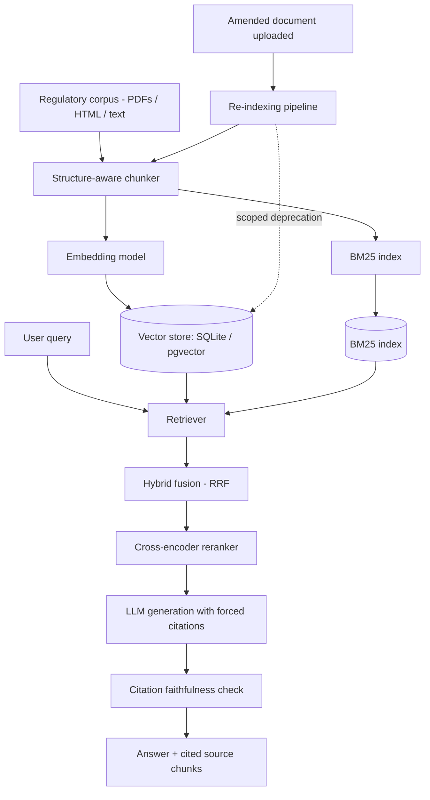

# Regulation-Tracking RAG System

A production-grade retrieval-augmented generation system over Indian financial regulatory documents (RBI Master Circulars / Master Directions / notifications). It answers compliance-style questions with **cited sources**, correctly handles documents that **amend or supersede** earlier ones, and is measured with **real information-retrieval metrics** instead of manual spot-checking.

It ships as a working application: a chat UI where you talk to the circulars, an upload flow where you add a new circular and the index rebuilds itself, a REST API, an evaluation harness, and a test-suite.

This is not a "chat with your PDF" demo. The domain was chosen because it has genuine retrieval difficulty: amended/superseded documents, tables mixed with prose, and cross-references between circulars.

**Status**: ✅ v1.0 — implemented, tested (43 tests), evaluated.

---

## Table of contents

- [What it does](#what-it-does)
- [Quickstart & How to Run](#quickstart--how-to-run)
- [Getting the real RBI corpus](#getting-the-real-rbi-corpus)
- [Architecture](#architecture)
- [Project structure](#project-structure)
- [Tech stack](#tech-stack)
- [The chat application](#the-chat-application)
- [API reference](#api-reference)
- [Evaluation](#evaluation)
- [The stale-data case study](#the-stale-data-case-study)
- [Configuration](#configuration)
- [Deployment](#deployment)
- [Testing](#testing)
- [Why this is different from a generic RAG demo](#why-this-is-different-from-a-generic-rag-demo)
- [Compliance & scope note](#compliance--scope-note)
- [License](#license)

---

## What it does

| Capability | How it is implemented |
|---|---|
| Chat with the circulars | `POST /api/chat` → hybrid retrieval → reranking → cited answer, with chat history persisted per session |
| Add a new circular | Upload PDF/TXT/MD/HTML (or paste text) in the UI → parsed, chunked, embedded, indexed **live**, no restart |
| Self-updating on amendment | An uploaded amendment that says *"in supersession of paragraph 6 of …"* deprecates exactly those chunks of the earlier document and links the versions |
| Never lose history | Superseded chunks are never deleted — excluded from default retrieval, still queryable in **audit mode** |
| Verifiable answers | Every claim carries `[n]` citations; an automated faithfulness check verifies each cited passage actually supports the claim, and the score is shown in the UI |
| Refuses rather than hallucinates | A retrieval-confidence floor makes out-of-domain questions return "the indexed circulars do not contain enough information" |
| Measurable retrieval | BM25 / dense / hybrid-RRF / hybrid+rerank and three chunkers, all scored with Precision@k, Recall@k, nDCG@10, MRR |

---

## Quickstart & How to Run

Requires Python 3.11+. The system runs out of the box on CPU with **zero required external services** (uses local SQLite by default; MongoDB is not needed).

### Step 1: Install Dependencies

```bash
# Clone the repository
git clone <this repo>
cd Regulations-Tracking-RAG-System

# (Optional) Create & activate a virtual environment
# Windows:
python -m venv .venv
.venv\Scripts\activate
# Linux / macOS:
python -m venv .venv && source .venv/bin/activate

# Install core dependencies
pip install -r requirements.txt
```

### Step 2: Configure Environment (`.env`)

Create or update your `.env` file (copy from `.env.example` if starting fresh):

```bash
# Windows:
copy .env.example .env
# Linux / macOS:
cp .env.example .env
```

Configure your LLM provider and API keys in `.env`:

```ini
# ---- generation ----
# Choose provider: groq | gemini | extractive (no API key needed)
LLM_PROVIDER=groq
GROQ_API_KEY=your_groq_api_key_here
GEMINI_API_KEY=your_gemini_api_key_here

# Supported free models on Groq:
# - openai/gpt-oss-120b   (deep reasoning & high quality)
# - qwen/qwen3.8-27b      (blazing fast ~1s latency, 100% citation faithfulness)
# - openai/gpt-oss-20b    (fast & lightweight)
LLM_MODEL=openai/gpt-oss-120b
```

> [!TIP]
> - **Groq**: Generous free-tier limits. `openai/gpt-oss-120b` and `qwen/qwen3.8-27b` work out of the box.
> - **Gemini**: Supported using `LLM_PROVIDER=gemini` (defaults to `gemini-3.6-flash`).
> - **No API Key?** Set `LLM_PROVIDER=extractive` to run 100% locally with zero external API calls.

### Step 3: Index the Regulatory Corpus

Seed the database (SQLite) with the initial 8 RBI Master Circulars and amendment fixtures:

```bash
python -m ingestion.reindex --reset --seed
```

Check the index status at any time with:
```bash
python -m ingestion.reindex --status
```

### Step 4: Start the Web Application

Launch the FastAPI/Uvicorn server:

```bash
python -m uvicorn app.main:app --reload --port 8000
```

Open your browser and navigate to:
👉 **[http://localhost:8000](http://localhost:8000)** (or `http://127.0.0.1:8000`)

- **Interactive LLM Switching**: In the sidebar under **LLM Generation**, switch between **Groq**, **Gemini**, or **Extractive**, and choose your preferred model directly in the browser.
- **Citation Inspection**: Click any suggested question (or type your own), review the cited claims, faithfulness badge, and expand **📎 cited sources** to see the exact regulatory paragraphs referenced.
- **Swagger API Docs**: View the interactive OpenAPI documentation at **[http://localhost:8000/docs](http://localhost:8000/docs)**.

---

### Alternative: Run with Docker

If you prefer running via Docker Compose:

```bash
# Build and run the app container (includes auto-seeded SQLite database)
docker compose up --build

# Optional: run with PostgreSQL + pgvector
docker compose --profile postgres up
```

---

### Useful Commands & Verification

| Action | Command |
|---|---|
| **Run All 43 Tests** | `python -m pytest` |
| **Run Retrieval Evaluation** | `python -m evaluation.run_eval --experiment retrieval` |
| **Run Chunking Evaluation** | `python -m evaluation.run_eval --experiment chunking --k 5` |
| **Run Amendment Case Study** | `python scripts/case_study_amendment.py` |
| **Re-embed Chunks** | `python -m ingestion.reindex --reembed` |
| **Scrape Genuine RBI Docs** | `python -m ingestion.fetch_rbi --category master-circulars --limit 40 --out corpus/raw` |

**Defaults are deliberately dependency-free** so the system runs anywhere:

| Component | Default (zero-setup) | Production option |
|---|---|---|
| Store | SQLite | Postgres + pgvector (`DATABASE_URL=postgresql+psycopg://…`) |
| Embeddings | deterministic hashing embedder (CPU, no download) | `sentence-transformers` `BAAI/bge-small-en-v1.5` (`pip install -r requirements-ml.txt`) |
| Reranker | lexical IDF/phrase reranker | `BAAI/bge-reranker-base` cross-encoder |
| Generation | Groq (`openai/gpt-oss-120b`, `qwen/qwen3.8-27b`) or Extractive | Gemini (`gemini-3.6-flash`) / OpenAI |

---

## Getting the real RBI corpus

The seed corpus in `corpus/seed/` is a set of eight **offline fixtures** written in exact RBI circular format (numbering, tables, supersession language) so the system, tests and evaluation are reproducible with no network access. To index the genuine documents from rbi.org.in:

```bash
# scrape a listing page and download the documents (HTML page or attached PDF)
python -m ingestion.fetch_rbi --category master-circulars --limit 40 --out corpus/raw
python -m ingestion.fetch_rbi --category master-directions --limit 40 --out corpus/raw

# or one specific circular
python -m ingestion.fetch_rbi --url "https://www.rbi.org.in/Scripts/NotificationUser.aspx?Id=13699&Mode=0"

# index whatever was downloaded
python -m ingestion.reindex --path corpus/raw
python -m ingestion.reindex --status
```

`fetch_rbi` rate-limits itself (1.5 s between requests), prefers the attached PDF over the HTML page, and writes a `manifest.json` recording every source URL, title and fetch timestamp so the corpus is auditable. Downloads land in `corpus/raw/`, which is git-ignored.

> Note: the sandbox this repository was developed in blocks egress to `rbi.org.in`, so the numbers reported below were produced on the seed corpus. Run the two commands above on a machine with network access to reproduce everything against the real documents — no code changes are needed.

---

## Architecture



Full design detail is in [`Project-Details.md`](./Project-Details.md).

---

## Project structure

```
.
├── README.md / Project-Details.md
├── core/                       # config, SQLAlchemy models, DB session, logging
│   ├── config.py  db.py  models.py  logging_conf.py
├── ingestion/
│   ├── parse.py                # PDF/HTML/text -> normalised text, doc-number/date/supersession extraction
│   ├── chunkers/               # fixed_size.py, recursive.py, structure_aware.py
│   ├── embed.py                # hashing + sentence-transformers providers
│   ├── pipeline.py             # ingest, version, scoped deprecation, re-chunk, re-embed
│   ├── fetch_rbi.py            # real rbi.org.in downloader
│   └── reindex.py              # CLI
├── retrieval/
│   ├── corpus_index.py  bm25.py  dense.py  hybrid_rrf.py  rerank.py  service.py
├── generation/
│   ├── llm.py  prompts.py  answer.py  faithfulness.py
├── evaluation/
│   ├── metrics.py              # P@k, R@k, nDCG@10, MRR (+ ranx cross-check)
│   ├── domain_track/queries.json   # 35 hand-labelled queries, graded 0/1/2
│   ├── beir_track/run_beir.py  # Track A: FiQA-2018
│   └── run_eval.py             # retrieval / chunking / faithfulness experiments
├── app/
│   ├── main.py  schemas.py
│   └── static/                 # chat UI (no build step)
├── corpus/seed/                # 8 RBI-format fixture circulars + amendment chain
├── scripts/case_study_amendment.py
├── tests/                      # 43 tests
└── Dockerfile, docker-compose.yml, Makefile, .github/workflows/ci.yml
```

---

## Tech stack

| Layer | Choice | Why |
|---|---|---|
| Vector storage | SQLite (default) or pgvector on Postgres | Chunks, metadata and version status live in one queryable place; no separate vector DB to operate |
| Sparse retrieval | `rank_bm25` over a shared corpus snapshot | Lexical baseline; regulatory text is full of exact identifiers |
| Dense retrieval | hashing embedder (default) or `sentence-transformers` bge/e5 | Free, CPU-only, no rate limits; the default is deterministic, which keeps CI and eval reproducible |
| Fusion | Reciprocal Rank Fusion (k=60) | Rank-based, so no score normalisation between BM25 and cosine |
| Reranker | lexical (default) or `bge-reranker-base` cross-encoder | Re-scores the fused candidates against the query |
| Generation | extractive (default), Groq / Gemini / OpenAI | Works with no key; upgrade with one env var |
| Evaluation | own graded-relevance metrics, cross-checked against `ranx` when installed | Real IR methodology, no hand-waving |
| Backend | FastAPI + SQLAlchemy 2.0 | Typed API, OpenAPI docs at `/docs` |
| Frontend | Vanilla JS + CSS, served by FastAPI | No build step, no node_modules |

---

## The chat application

The single-page UI at `/` gives you:

- **Chat** — ask a question, get an answer where every `[n]` is clickable and scrolls to the exact passage it came from.
- **Per-answer diagnostics** — citation-faithfulness score, retrieval mode, number of passages, latency, provider and token usage.
- **Retrieval controls** — switch between BM25 / dense / hybrid / hybrid+rerank and change top-k live; useful for showing *why* hybrid wins.
- **Audit mode** — a checkbox that includes superseded text, which the answer then explicitly flags.
- **Corpus panel** — every indexed document with its version, chunk counts and whether an older version has been superseded.
- **"Add new circular"** — upload a file or paste text, optionally declaring what it supersedes. The index is rebuilt in the same request, and the very next question can already use it.

---

## API reference

| Method | Path | Purpose |
|---|---|---|
| `GET` | `/api/health` | Liveness, active providers, index statistics |
| `POST` | `/api/chat` | `{message, session_id?, mode?, top_k?, include_deprecated?}` → cited answer |
| `POST` | `/api/search` | Raw retrieval, no generation (debugging / eval) |
| `POST` | `/api/documents/upload` | Multipart upload of a new circular; re-indexes immediately |
| `POST` | `/api/documents/text` | Same, for pasted text |
| `GET` | `/api/documents` | Documents with version history and supersession links |
| `GET` | `/api/chunks/{id}` | Citation drill-down to a single chunk |
| `GET` | `/api/sessions`, `/api/sessions/{id}` | Chat history |
| `POST` | `/api/reindex` | Rebuild the retrieval index from the database |

Interactive docs: <http://localhost:8000/docs>

```bash
curl -s localhost:8000/api/chat -H 'content-type: application/json' \
  -d '{"message":"What is the minimum cooling-off period for a digital loan?"}' | jq .answer
```

---

## Evaluation

```bash
make eval                                   # everything
python -m evaluation.run_eval --experiment retrieval --k 5
python -m evaluation.beir_track.run_beir --dataset fiqa --subset 200   # Track A (needs network)
```

Results are written to `evaluation/results/results.{json,md}` and every per-query score is persisted to the `eval_runs` / `eval_results` tables.

**Track B — domain-specific eval set.** 35 hand-written queries over the corpus with graded 0/1/2 judgments (`evaluation/domain_track/queries.json`). Judgments are anchored to `(doc_number, anchor phrase)` pairs rather than chunk ids, so **the same labelled set stays valid when the corpus is re-chunked** — which is what makes the chunking comparison a fair test. The judging protocol and its limitations (single annotator, no inter-annotator agreement) are documented in that file.

### Retrieval strategy comparison — default stack, k=5

| Configuration | Precision@5 | Recall@5 | nDCG@10 | MRR | Latency (ms/query) |
|---|---|---|---|---|---|
| BM25 only | 0.223 | 1.000 | 0.936 | 0.914 | 24 |
| Dense only | 0.206 | 0.929 | 0.928 | 0.943 | <1 |
| Hybrid (RRF) | 0.217 | 0.971 | **0.942** | 0.936 | 1 |
| Hybrid + rerank | 0.223 | 1.000 | 0.920 | 0.896 | 3 |

### Chunking strategy comparison — hybrid+rerank, k=5

| Chunker | Precision@5 | Recall@5 | nDCG@10 | MRR | Chunks |
|---|---|---|---|---|---|
| fixed | **0.274** | 1.000 | 0.926 | 0.901 | 26 |
| recursive | 0.229 | 1.000 | **0.946** | **0.930** | 31 |
| structure-aware | 0.234 | 0.971 | 0.891 | 0.868 | 39 |

### Citation faithfulness

| Queries | Mean faithfulness | Fully faithful answers | Uncited claims | Invalid citations |
|---|---|---|---|---|
| 35 | 0.862 | 7/35 | 0 | 0 |

### Reading these numbers honestly

- **Hybrid wins on nDCG@10, but the margin over BM25 is small**, and the *lexical* fallback reranker actually costs nDCG here. That is the honest result on this corpus with the default stack — not the result the architecture diagram predicts. Two reasons: the corpus is small (8 documents, ~34 chunks) so lexical matching is already close to ceiling, and the default embedder is a hashing embedder rather than a neural one. Install `requirements-ml.txt`, set `EMBEDDING_PROVIDER=sentence-transformers` + `RERANKER_PROVIDER=cross-encoder`, re-run `make eval`, and the harness — not the README — decides the winner.
- **Precision@5 is capped around 0.2–0.3 by construction**: most queries have exactly one relevant chunk, so P@5 cannot exceed 0.2–0.4. Recall@5, nDCG@10 and MRR are the informative columns here.
- **Structure-aware chunking loses on this corpus** because it produces more, smaller chunks; it wins on table integrity (6 tables preserved atomically, verified by tests) and on provenance (section paths attached to every chunk), which matter for the amendment pipeline. It is the default for that reason, and the trade-off is stated rather than hidden.
- Track A (BEIR/FiQA-2018) runs the *same* retrieval classes against a standard benchmark; it requires network access to download the dataset.

---

## The stale-data case study

`make case-study` (full transcript: [`docs/case-study-amendment.txt`](./docs/case-study-amendment.txt))

1. Index **only** the 2016 KYC Master Direction. Ask about periodic updation for high-risk customers → the answer says **two years**, cited to `RBI/DBR/2015-16/18` §6.
2. Push the 2026 amendment through the ingestion pipeline. It states *"In supersession of paragraph 6 of Master Direction DBR.AML.BC.No.81/14.01.001/2015-16"*, so the pipeline:
   - resolves the departmental circular number to the indexed document (RBI documents carry two identifiers),
   - parses the **scope** of the supersession (`paragraph 6`),
   - deprecates only the §6 chunks — and where a chunk straddled §6 and §7, **splits it**, deprecating the superseded half and re-inserting the surviving half as an active chunk,
   - links the versions via `supersedes_id` / `superseded_by_id`.
3. Re-run the identical query → the answer now says **three years**, cited to `RBI/2026-27/88`. The two-year text no longer appears, and the answer carries a notice that the sources span multiple publication dates.
4. Re-run with `include_deprecated=true` → the superseded 2016 text is retrieved again, clearly marked `SUPERSEDED`, with an audit-mode notice on the answer. Nothing was deleted.

Enforced by `tests/test_amendment_pipeline.py`, which fails if a superseded rule ever resurfaces in default retrieval.

---

## Configuration

Everything is environment-driven (`.env`, see `.env.example`):

| Variable | Default | Notes |
|---|---|---|
| `DATABASE_URL` | `sqlite:///./data/regrag.db` | Postgres+pgvector supported; the extension is created automatically |
| `EMBEDDING_PROVIDER` / `EMBEDDING_MODEL` / `EMBEDDING_DIM` | `hashing` / `bge-small-en-v1.5` / `1024` | |
| `RERANKER_PROVIDER` / `RERANKER_MODEL` | `lexical` / `bge-reranker-base` | |
| `LLM_PROVIDER` / `LLM_MODEL` + API key | `extractive` | `groq`, `gemini`, `openai` |
| `CHUNKER` / `CHUNK_TOKENS` / `CHUNK_OVERLAP` | `structure_aware` / `350` / `60` | |
| `RETRIEVAL_MODE` / `TOP_K` / `CANDIDATE_K` / `RRF_K` | `hybrid_rerank` / `8` / `40` / `60` | |

Missing optional dependencies or API keys degrade gracefully with a logged warning instead of crashing — e.g. selecting `cross-encoder` without `sentence-transformers` installed falls back to the lexical reranker.

---

## Deployment

```bash
docker compose up --build              # app on :8000, index built at image build time
docker compose --profile postgres up   # adds a pgvector/pg16 database
```

The image is CPU-only and small (no torch unless you add `requirements-ml.txt`). A `HEALTHCHECK` hits `/api/health`. The same container runs on Cloud Run / Koyeb / Fly free tiers; set `DATABASE_URL` to a Neon/Supabase Postgres URL for persistence across deploys.

## Testing

```bash
python -m pytest      # or `make test` (43 tests, ~2 s)
```

Covering: the three chunkers (including table atomicity and section paths), parsing/date/doc-number/supersession extraction, IR metrics against hand-computed values, all four retrieval modes, deprecation semantics (scoped and full), idempotent re-ingestion, version bumping, refusal on out-of-domain questions, faithfulness detection of unsupported claims and invalid citations, and every API endpoint including upload → immediately answerable. The GitHub Actions workflow in `ci/github-actions-ci.yml` runs the tests, builds the index, runs the evaluation and reproduces the case study on every push — move it to `.github/workflows/ci.yml` to activate it (see `ci/README.md`).

---

## Why this is different from a generic RAG demo

| Generic PDF-chat project | This project |
|---|---|
| One static, clean PDF | A corpus of regulatory documents that genuinely amend and supersede each other |
| "It works when I tried it" | Precision@k, Recall@k, nDCG@10, MRR on a hand-labelled query set, persisted per run |
| One chunking approach, unexamined | Three chunking strategies compared head-to-head with numbers |
| One retrieval method | BM25 vs dense vs hybrid vs hybrid+reranking, measured against the same query set |
| No handling of document updates | A re-indexing pipeline that parses supersession *scope*, splits straddling chunks, deprecates without deleting, and is regression-tested |
| Answers with no way to check correctness | Every answer cites its chunk, an automated check verifies the citation supports the claim, and the score is shown to the user |
| Hallucinates when retrieval fails | A confidence floor makes it refuse instead |

## Compliance & scope note

This project answers questions about publicly available regulatory text for informational and research purposes only. It is not legal or financial advice and should not be relied on as a substitute for the primary source document or a qualified professional. The documents in `corpus/seed/` are format-faithful fixtures, **not** authentic RBI text — use `ingestion/fetch_rbi.py` to index the real thing.

## License

MIT.
